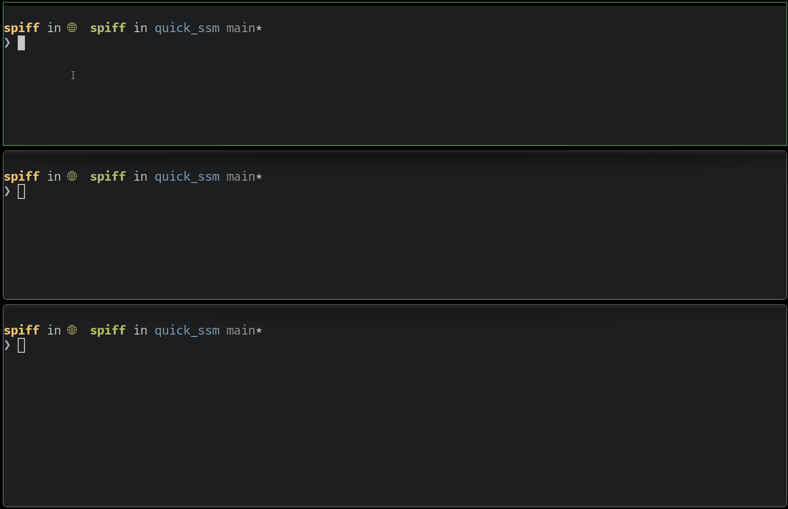

# Quick SSM

A simple Go CLI tool for quickly connecting to AWS EC2 instances via AWS Systems Manager (SSM) Session Manager. This tool lists all your EC2 instances and allows you to select one for an interactive SSM session. This tool stays pretty simple leveraging the `aws-cli` to marshal the websocket connection to their platform which lets this code stay pretty static.


We support simple port forwarding:



When inevitably some instance does not work we support a `--check` mode that lets you quickly diagnose common problems:


## ✨ Features

- **Interactive Instance Selection**: Lists all EC2 instances with numbered menu
- **Port Forwarding**: Forward a local TCP port to the instance via SSM
- **Diagnostic Mode**: Comprehensive checks for SSM connectivity requirements
- **Instance State Display**: Shows running status with color-coded indicators
- **Smart Naming**: Handles duplicate instance names with numbering (e.g., "web-server (2)")
- **State Warnings**: Alerts when trying to connect to non-running instances
- **Visual Feedback**: Color-coded output with alternating row colors for easy scanning
- **Graceful Shutdown**: Proper signal handling for clean session termination
- **Private Mode**: Hide account information for screenshots and demos

Calling is straight forward and we work well with other AWS CLI tools:

```bash
quick_ssm # Use default profile
quick_ssm --check # Run in diagnostic mode
quick_ssm --port-forward 80 # Forward localhost:80 to instance:80
quick_ssm --port-forward 8080:80 # Forward localhost:8080 to instance:80
AWS_PROFILE=production quick_ssm # Use specific profile
aws-vault exec production -- quick_ssm # Using aws-vault
granted production quick_ssm # Using granted
```

## Prerequisites

### Required Software

1. **Go 1.24.4 or later** - [Download and install Go](https://golang.org/dl/)
2. **AWS CLI** - [Install AWS CLI](https://docs.aws.amazon.com/cli/latest/userguide/getting-started-install.html#getting-started-install-instructions)

### Install with Homebrew (macOS/Linux)
```bash
brew tap bevelwork/quick_ssm https://github.com/bevelwork/quick_ssm
brew install quick-ssm
```

### Install with Go
```bash
go install github.com/bevelwork/quick_ssm@latest
```

### Or Build from Source
```bash
git clone https://github.com/bevelwork/quick_ssm.git
cd quick_ssm
go build -o quick_ssm .
```

### What Diagnostic Mode Checks

The `--check` flag verifies SSM connectivity requirements:

- ✅ **Instance State**: Checks if instance is running and ready
- ✅ **IAM Role**: Instance has proper SSM permissions
- ✅ **Internet Access**: Subnet has internet gateway route  
- ✅ **Security Groups**: Allow HTTPS outbound traffic

## How It Works

1. **Authentication**: Uses AWS SDK v2 to authenticate with your AWS account
2. **Instance Discovery**: Queries EC2 to get all instances using pagination
3. **Name Resolution**: Extracts instance names from EC2 tags (assumes first tag is the name)
4. **Duplicate Handling**: Adds numbers to duplicate names for clarity
5. **Sorting**: Sorts instances alphabetically by name, then by ID
6. **SSM Connection**: Uses AWS CLI to establish the SSM session
7. **Signal Handling**: Properly handles interrupt signals for clean shutdown

## Troubleshooting

### Common Issues

1. **"AWS CLI not found"**
   - Install AWS CLI following the [official installation guide](https://docs.aws.amazon.com/cli/latest/userguide/getting-started-install.html)

2. **"failed to authenticate with aws"**
   - Run `aws configure` to set up your credentials
   - Verify your credentials with `aws sts get-caller-identity`

3. **"SSM session failed"**
   - Ensure the target instance has SSM Agent installed and running
   - Verify the instance has the required IAM role with SSM permissions
   - Check that the instance is in a subnet with internet access or VPC endpoints for SSM

4. **No instances listed**
   - Verify you have `ec2:DescribeInstances` permissions
   - Check that your instances have the required tags
   - Ensure you're in the correct AWS region

5. **"Instance not found" or connection timeout**
   - Verify the instance is running
   - Check that SSM Agent is running on the instance
   - Ensure network connectivity between your machine and AWS

### AWS Configuration

1. **AWS Credentials**: Configure your AWS credentials one of these methods:
2. **Required IAM Permissions**: Your AWS credentials need the following permissions:
   ```json
   {
     "Version": "2012-10-17",
     "Statement": [
       {
         "Effect": "Allow",
         "Action": [
           "ec2:DescribeInstances",
           "ec2:DescribeSubnets",
           "ec2:DescribeRouteTables",
           "ec2:DescribeSecurityGroups",
           "sts:GetCallerIdentity"
         ],
         "Resource": "*"
       },
       {
         "Effect": "Allow",
         "Action": [
           "ssm:StartSession"
         ],
         "Resource": "arn:aws:ec2:*:*:instance/*"
       },
       {
         "Effect": "Allow",
         "Action": [
           "iam:ListAttachedRolePolicies",
           "iam:ListRolePolicies",
           "iam:GetRolePolicy"
         ],
         "Resource": "*"
       }
     ]
   }
   ```

3. **SSM Agent**: Target EC2 instances must have the SSM Agent installed and running. Most modern Amazon Linux, Ubuntu, and Windows AMIs include it by default.

4. **Instance IAM Role**: EC2 instances need an IAM role with the `AmazonSSMManagedInstanceCore` policy attached.

## Version Management

This project uses a simple date-based versioning system: `major.minor.YYYYMMDD`
