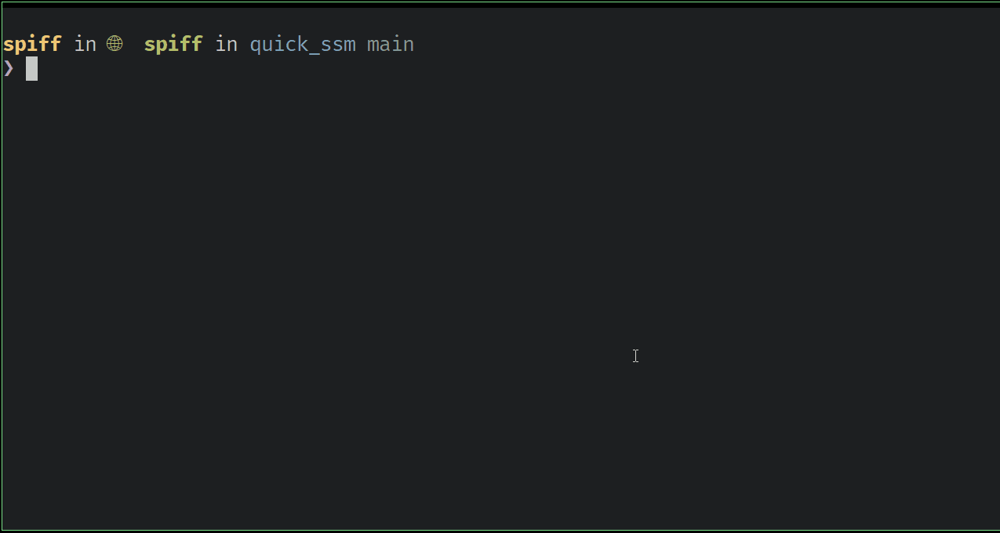
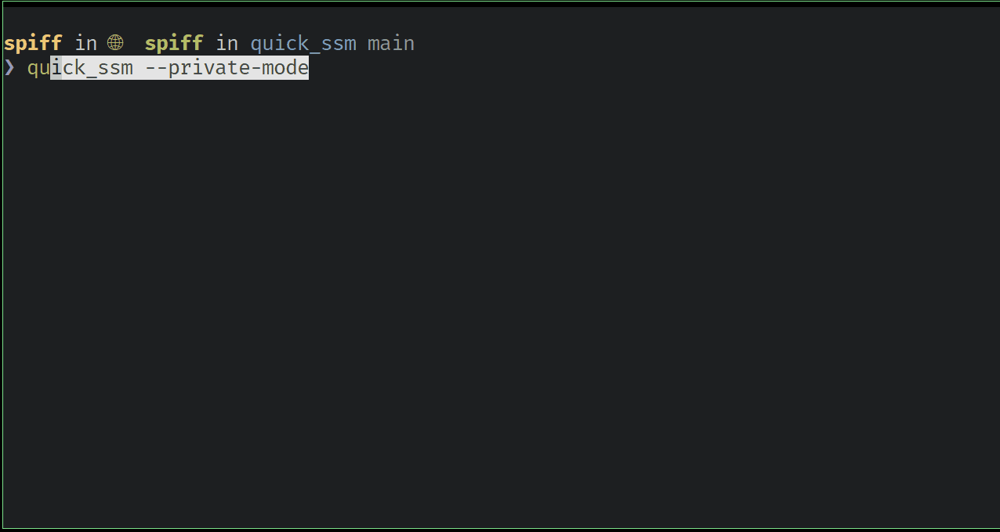

# Quick SSM

A simple Go CLI tool for quickly connecting to AWS EC2 instances via AWS Systems Manager (SSM) Session Manager. This tool lists all your EC2 instances and allows you to select one for an interactive SSM session.



When inevitably some instance does not work we support a `--check` mode that lets you quickly diagnose common problems.



## ✨ Features

- **Interactive Instance Selection**: Lists all EC2 instances with numbered menu
- **Instance State Display**: Shows running status with color-coded indicators
- **Smart Naming**: Handles duplicate instance names with numbering (e.g., "web-server (2)")
- **Diagnostic Mode**: Comprehensive checks for SSM connectivity requirements
- **State Warnings**: Alerts when trying to connect to non-running instances
- **Visual Feedback**: Color-coded output with alternating row colors for easy scanning
- **Graceful Shutdown**: Proper signal handling for clean session termination
- **Private Mode**: Hide account information for screenshots and demos

## Prerequisites

### Required Software

1. **Go 1.24.4 or later** - [Download and install Go](https://golang.org/dl/)
2. **AWS CLI** - [Install AWS CLI](https://docs.aws.amazon.com/cli/latest/userguide/getting-started-install.html#getting-started-install-instructions)

### AWS Configuration

1. **AWS Credentials**: Configure your AWS credentials using one of these methods:
   - AWS CLI: `aws configure`
   - Environment variables: `AWS_ACCESS_KEY_ID`, `AWS_SECRET_ACCESS_KEY`, `AWS_SESSION_TOKEN`
   - IAM roles (if running on EC2)
   - AWS credentials file

2. **Required IAM Permissions**: Your AWS credentials need the following permissions:
   ```json
   {
     "Version": "2012-10-17",
     "Statement": [
       {
         "Effect": "Allow",
         "Action": [
           "ec2:DescribeInstances",
           "ec2:DescribeSubnets",
           "ec2:DescribeRouteTables",
           "ec2:DescribeSecurityGroups",
           "sts:GetCallerIdentity"
         ],
         "Resource": "*"
       },
       {
         "Effect": "Allow",
         "Action": [
           "ssm:StartSession"
         ],
         "Resource": "arn:aws:ec2:*:*:instance/*"
       },
       {
         "Effect": "Allow",
         "Action": [
           "iam:ListAttachedRolePolicies",
           "iam:ListRolePolicies",
           "iam:GetRolePolicy"
         ],
         "Resource": "*"
       }
     ]
   }
   ```

3. **SSM Agent**: Target EC2 instances must have the SSM Agent installed and running. Most modern Amazon Linux, Ubuntu, and Windows AMIs include it by default.

4. **Instance IAM Role**: EC2 instances need an IAM role with the `AmazonSSMManagedInstanceCore` policy attached.

## 🚀 Quick Start

### Install with Go
```bash
go install github.com/bevelwork/quick_ssm@latest
```

### Or Download Release
```bash
# Download latest release
curl -L https://github.com/bevelwork/quick_ssm/releases/latest/download/quick_ssm-v1.0.0-linux-amd64 -o quick_ssm
chmod +x quick_ssm
```

### Or Build from Source
```bash
git clone https://github.com/bevelwork/quick_ssm.git
cd quick_ssm
go build -o quick_ssm .
```

## 📖 Usage

### Basic Connection
```bash
quick_ssm
```
*See the [Basic Usage Demo](#-demo) above for a visual walkthrough*

### Diagnostic Mode
```bash
quick_ssm --check
```
*See the [Diagnostic Mode Demo](#-demo) above for a visual walkthrough*

### Command Options
```bash
quick_ssm -h                    # Show help
quick_ssm --private-mode        # Hide account info
quick_ssm --check               # Run diagnostics
```

### What Diagnostic Mode Checks

The `--check` flag verifies SSM connectivity requirements:

- ✅ **Instance State**: Checks if instance is running and ready
- ✅ **IAM Role**: Instance has proper SSM permissions
- ✅ **Internet Access**: Subnet has internet gateway route  
- ✅ **Security Groups**: Allow HTTPS outbound traffic

*See the [Diagnostic Mode Demo](#-demo) above for the full visual experience*

## 🎯 Perfect! Your `go install` is now working!

The issue was that your code needed to be committed and pushed to GitHub for `go install` to work. Now you can:

```bash
# Install the latest version
go install github.com/bevelwork/quick_ssm@latest

# Run it from anywhere
quick_ssm
```

## How It Works

1. **Authentication**: Uses AWS SDK v2 to authenticate with your AWS account
2. **Instance Discovery**: Queries EC2 to get all instances using pagination
3. **Name Resolution**: Extracts instance names from EC2 tags (assumes first tag is the name)
4. **Duplicate Handling**: Adds numbers to duplicate names for clarity
5. **Sorting**: Sorts instances alphabetically by name, then by ID
6. **SSM Connection**: Uses AWS CLI to establish the SSM session
7. **Signal Handling**: Properly handles interrupt signals for clean shutdown

## Troubleshooting

### Common Issues

1. **"AWS CLI not found"**
   - Install AWS CLI following the [official installation guide](https://docs.aws.amazon.com/cli/latest/userguide/getting-started-install.html)

2. **"failed to authenticate with aws"**
   - Run `aws configure` to set up your credentials
   - Verify your credentials with `aws sts get-caller-identity`

3. **"SSM session failed"**
   - Ensure the target instance has SSM Agent installed and running
   - Verify the instance has the required IAM role with SSM permissions
   - Check that the instance is in a subnet with internet access or VPC endpoints for SSM

4. **No instances listed**
   - Verify you have `ec2:DescribeInstances` permissions
   - Check that your instances have the required tags
   - Ensure you're in the correct AWS region

5. **"Instance not found" or connection timeout**
   - Verify the instance is running
   - Check that SSM Agent is running on the instance
   - Ensure network connectivity between your machine and AWS

### Debugging

Enable AWS CLI debug logging:
```bash
export AWS_CLI_FILE_ENCODING=UTF-8
export AWS_CLI_AUTO_PROMPT=off
aws configure set cli_log_level debug
```

## Dependencies

- [AWS SDK for Go v2](https://github.com/aws/aws-sdk-go-v2)
  - EC2 service (for instance discovery and network diagnostics)
  - IAM service (for role permission checks)
  - STS service (for authentication)
- AWS CLI (for SSM session management)

## License

This project is licensed under the Apache License 2.0. See the [LICENSE](LICENSE) file for details.

## Version Management

This project uses a simple date-based versioning system: `major.minor.YYYYMMDD`

### Version Format

- **Major.Minor**: Set in `version.yml` file
- **Date**: Automatically appended as YYYYMMDD format
- **Example**: `v1.0.20241201` (version 1.0 released on December 1, 2024)

### Automatic Versioning

- **Main branch pushes**: Automatically create release with current date
- **Manual releases**: Use GitHub Actions "Run workflow" to trigger release
- **Release artifacts**: Binary and checksums are automatically generated

### Manual Version Management

Update the base version in `version.yml` and use the provided scripts:

```bash
# Show current version
make version
# or
./scripts/version.sh current

# Update major version
make major 2
# or
./scripts/version.sh major 2

# Update minor version  
make minor 1
# or
./scripts/version.sh minor 1

# Build release binary locally
make build-release
```

### Release Process

1. **Automatic**: Push to main branch triggers release with current date
2. **Manual**: Use GitHub Actions "Run workflow" to create release
3. **Version Updates**: Edit `version.yml` to change major/minor versions
